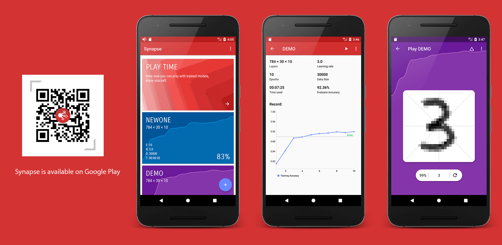

# Synapse
Synapse is a beauty, funny application which allows you train the SGD model to recognize MNIST handwritten digits on the local device directly. It does not depend on any deep learning library, just a pure Java implementation, for learning purposes only. 

## Enjoy Yourself

If your device doesn't have Google Play, you can download it from [this site](http://fir.im/6vta).

## License

    Copyright 2016 HuazhouWang.

    Licensed under the Apache License, Version 2.0 (the "License");
    you may not use this file except in compliance with the License.
    You may obtain a copy of the License at
    
       http://www.apache.org/licenses/LICENSE-2.0
    
    Unless required by applicable law or agreed to in writing, software
    distributed under the License is distributed on an "AS IS" BASIS,
    WITHOUT WARRANTIES OR CONDITIONS OF ANY KIND, either express or implied.
    See the License for the specific language governing permissions and
    limitations under the License.
